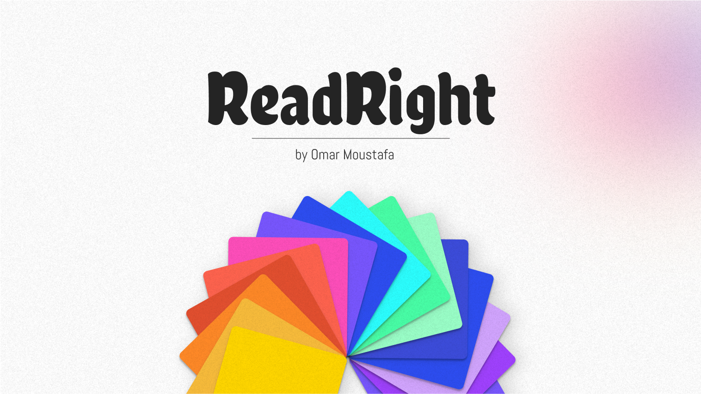

<p align="center">
  
</p>

# ReadRight Backend Worker

This repository contains the backend worker for **ReadRight**, a reading assistant app that cares about accessibility.
The function takes an article (via text or URL), simplifies it for dyslexia-friendly reading, summarizes it into bullet points, and generates an audio narration.

It uses:

- [Google Gemini](https://ai.google.dev/) → text simplification & summarization
- [Diffbot](https://www.diffbot.com/) → clean article extraction
- [Edge TTS](https://github.com/rany2/edge-tts) → text-to-speech
- [Appwrite](https://appwrite.io/) → storage, database, and function hosting

---

## ✨ Features

- Fetch and clean article text from URLs
- Rewrite articles in a **dyslexia-friendly format**
- Generate **bullet-point TL;DR summaries**
- Produce **TTS audio narration** (MP3)
- Store results in Appwrite **Storage + Database**

---

## 🛠 Requirements

- Python (3.11 is recommended)
- Appwrite project with:
  - Storage bucket
  - Database + table
  - API key with access to Storage + Database
- Environment variables configured (see below)

---

## ⚙️ Environment Variables

Set these in Appwrite or your local `.env` file:

```bash
APPWRITE_FUNCTION_PROJECT_ID=your-project-id
APPWRITE_BUCKET_ID=your-bucket-id
APPWRITE_DATABASE_ID=your-database-id
APPWRITE_TABLE_ID=your-table-id
GEMINI_API_KEY=your-gemini-api-key
DIFFBOT_TOKEN=your-diffbot-token
```

Note: `APPWRITE_FUNCTION_PROJECT_ID` env is automatically set by Appwrite Functions, unless you're testing locally.
